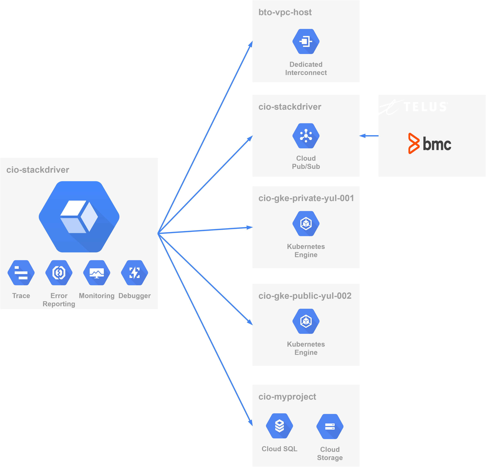
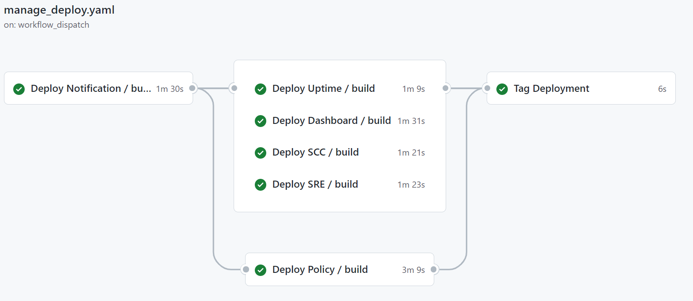

# cio-stackdriver

The CIO Stackdriver project acts as an accumulator of projects that are required to be monitored by Stackdriver. The objective is to be able to provide a single pane of glass for monitoring.





## Stackdriver Projects
PROD and NONPROD stackdriver projects have been established to allow team members to develop and deploy their monitoring solutions. 

| Project Name                                                   | Project ID                       | Environment   |
| ---------------------------------------------------------------|----------------------------------|---------------|
|[cio-stackdriver-np](https://console.cloud.google.com/monitoring?project=cio-stackdriver-np-b75434)|cio-stackdriver-np-b75434 | NONPROD |
|[cio-stackdriver-pr](https://console.cloud.google.com/monitoring?project=cio-stackdriver-pr-7f46b3)|cio-stackdriver-pr-7f46b3 | PROD |

## Stackdriver Access

Access to Stackdriver is managed by the following distribution lists. 

| Google Group                                                  | Role                        | Default Members   |
| -------------------------------------------------------------- |-----------------------------| ------------------|
| [`cio-cloud-monitoring-editor-ggrp@telus.com`](https://github.com/telus/tf-infra-gcp-groups/blob/master/terraform/cloud_monitoring/cio-cloud-monitoring-editor.json) | Editor Access to Stackdriver NP| None              |
| [`cio-cloud-monitoring-viewer-ggrp@telus.com`](https://github.com/telus/tf-infra-gcp-groups/blob/master/terraform/cloud_monitoring/cio-cloud-monitoring-viewer.json) | View Access to Stackdriver  | [`cio-gke-viewer-ggrp@telus.com`](https://github.com/telus/tf-infra-gcp-groups/blob/master/terraform/gke/cio-gke-viewer.json) |

> Most team members will have view access based on their inclusion in `cio-gke-viewer-ggrp@telus.com`. 
> - If you require NP editor privleges please create a Pull Request against the Google Group [`cio-cloud-monitoring-editor-ggrp@telus.com`](https://github.com/telus/tf-infra-gcp-groups/blob/master/terraform/cloud_monitoring/cio-cloud-monitoring-editor.json)
> - If you require the ability to create resources that aren't covered by the appriopriate terraform resources please enage the [Cloud CoE](mailto:dlCIOCloudCoE@telus.com)

## Prometheus Sidecar Pattern

Google has announced that the previously published pattern of using a [`stackdriver-prometheus-sidecar`](https://cloud.google.com/stackdriver/docs/solutions/gke/prometheus#configuration) is no longer considered a [best practice](https://cloud.google.com/stackdriver/docs/solutions/gke/prometheus#before_you_begin) and that GKE users should migrate to [workload metrics](https://cloud.google.com/stackdriver/docs/solutions/gke/managing-metrics#workload-metrics).

Workload metrics will be availble in TELUS' shared clusters in early 2022. Until then, team members are advised to migrate any prometheus monitoring or alerting dependencies to [log based metrics](https://cloud.google.com/logging/docs/logs-based-metrics). 


## Host Project: Infrastructure Deployment

The terraform scripts in the root `terraform` directory will be responsible for creating the host stackdriver project.

## Monitored Projects

Inclusion of projects to the common host project will be introduced as part of the Cloud CoE onboarding process. Currently no terraform modules are availble, so projects must be added via the GUI or using the Alpha `accounts` API

```bash
./oauth2l header --json sa.json cloud-platform userinfo.email

curl --location --request POST 'https://stackdriver.googleapis.com/v2/accounts/cio-stackdriver-np-b75434/projects' \
    -H "$(./oauth2l header --json sa.json cloud-platform userinfo.email)" \
    --header 'Content-Type: application/json' \
    --data-raw '{"name": "accounts/cio-stackdriver-np-b75434 /projects/cio-duffy-labs-np-d43bf4"}'
```

## Contributing

> | &#x1F6D1;        | This repository is being migrated to use the __GitHub CloudBuild App__ and __CloudBuild Pull Request Triggers__. This is being done to minimize the number of shared secrets and improve reliability.                     | &#x1F6D1;     |
> --------------------|--------------------------------------|------|

The `terraform\` directory will contain a series directories that are based on stackdriver objects to be created. Additional subdirectories exist for customizing the input variables to the various objects. 

| Directory        | Description                     | Notes   |
| ---------------- | ------------------------------- | -------------------|
| [`terraform/uptime`](terraform/uptime) | Manages HTTP(s) [uptime checks](https://cloud.google.com/monitoring/uptime-checks) | | 
| [`terraform/notification`](terraform/notification) | Manages [notification channels](https://cloud.google.com/monitoring/support/notification-options) | | 
| [`terraform/policy`](terraform/policy) | Manages [alerting policies](https://cloud.google.com/monitoring/alerts/types-of-conditions) | Use `data` to reference notification channels. <br/> Use `markdown` to define the documentation of the policy, ideally in a separate file for readability. <br/> Filter references to uptime checks will need to be explicitly referenced because each of these states is managed separately  | 
| [`terraform/dashboard`](terraform/dashboards) | Manages [dashboards](https://cloud.google.com/monitoring/dashboards) |  Use `json` to define the dashboard, ideally in a seperate file for readability. | 
| [`terraform/sre`](terraform/sre) | Manages [microservices monitoring](https://cloud.google.com/stackdriver/docs/solutions/slo-monitoring/microservices) |  Define SLI/SLO/SLA for microservices | 

Teams must [fork](https://help.github.com/en/github/getting-started-with-github/fork-a-repo) the repository `tf-infra-cio-stackdriver`, and create a [pull request](https://help.github.com/en/github/collaborating-with-issues-and-pull-requests/creating-a-pull-request-from-a-fork) to the `master` branch have their contributions included. The [Cloud CoE](mailto:dlCIOCloudCoE@telus.com) will then review and merge this request.

## Trunk Based Model

This repository uses a trunk based model. The appropriate configuration must be supplied in the appropriate subdirectories:

| Resource        | NP                     | PR   |
| ---------------- | ------------------------------- | -------------------|
| [`terraform/notification`](terraform/notification) | [`terraform/notifictation/np`](terraform/notification/np) | [`terraform/notification/pr`](terraform/notification/pr)|
| [`terraform/uptime`](terraform/uptime) | [`terraform/uptime/np`](terraform/uptime/np) | [`terraform/uptime/pr`](terraform/uptime/pr)|
| [`terraform/policy`](terraform/policy) | [`terraform/policy/np`](terraform/policy/np) | [`terraform/policy/pr`](terraform/policy/pr)|
| [`terraform/dashboard`](terraform/dashboard) | [`terraform/dashboard/np`](terraform/dashboard/np) | [`terraform/dashboard/pr`](terraform/dashboard/pr)|
| [`terraform/sre`](terraform/sre) | [`terraform/sre/np`](terraform/sre/np) | [`terraform/sre/pr`](terraform/sre/pr)|

This must be contributed in the form of an `auto.tfvars` file. This pattern was chosen to minimize the number of merges that were required to support a multicontributor environment. 

For example, the file [`ecp.auto.tfvars`](terraform/uptime/pr) sets the variable ecp_project_id:
```
ecp_project_id="cio-notification-np-93822f"
```
Since independent states are used for each object, this configuration may need to be repeated. 

### Preventing Production Deployment

In order to prevent production deployment of assets that are not complete, consider using conditional variables to prevent resource creation.

```terraform
module "alert_policy" {
  count = var.env == "np" ? 1 : 0
}
```

Additionally, to prevent disruption to scheduled builds and pull request checks, variables __MUST__ be created with a default value. 

```terraform
variable "kong_cluster_id" {
  type    = string
  default = ""
}
```

## Exporting Dashboards
> &#x1F4A1;	Google Cloud Monitoring has introduced a [json dashboard editor](https://cloud.google.com/monitoring/charts/dashboards?hl=tr#edit-dashboard) which can be used as an alternative to APIs to export dashboards. 

>&#x1F6D1; Write access to PR stackdriver will be __SIGNIFICANTLY__ more restricted than the previous implementation. 

In the NP environment, select team members will have the ability to edit and create dashboards. These dashboards __MUST__ be exported using the [Dashboards API](https://cloud.google.com/monitoring/dashboards/api-dashboard) for promotion to PR. This API can be invoked via GCP's [API Explorer](https://cloud.google.com/monitoring/api/ref_v3/rest/v1/projects.dashboards/get). 

Once exported, the dashboard must be added to git, and MUST be templated to accept variables in the place of environment specific attributes. 

For example the `filter` in the following block
```json
{
    "title": "Google Cloud HTTP/S Load Balancing Rule - Request count",
    "xyChart": {
        "dataSets": [
            {
                "timeSeriesQuery": {
                    "timeSeriesFilter": {
                        "filter": "metric.type=\"loadbalancing.googleapis.com/https/request_count\" resource.type=\"https_lb_rule\" resource.label.\"project_id\"=\"go-dv-b33d788f\"",
                        "aggregation": {
                            "perSeriesAligner": "ALIGN_RATE"
                        }
                    },
                    "unitOverride": "1"
                },
                "plotType": "LINE",
                "minAlignmentPeriod": "60s"
            }
        ],
        "timeshiftDuration": "0s",
        "yAxis": {
            "label": "y1Axis",
            "scale": "LINEAR"
        },
        "chartOptions": {
            "mode": "COLOR"
        }
    }
}
```

will need to be parameterized:

```terraform
"filter": "metric.type=\"loadbalancing.googleapis.com/https/request_count\" resource.type=\"https_lb_rule\" resource.label.\"project_id\"=\"${go_project_id}\""
```

Finally, any deployment specific attributes like `etag` __MUST__ be removed.

### Alert Chart Support

The new Alert Chart is dependent on the `id` of the alert policy established in the `policy` folder. Because this project uses multiple terraform states, a new convenience mechanism, [`alert_policies.tf`](./terraform/dashboard/alert_policies.tf) has been introduced to support use of that `id`.

The terraform [`lookup`](https://www.terraform.io/language/functions/lookup) function must be used against the map `data.external.alert_policies` to retrieve the `id` based on the display name of the policy.. The JSON respresentation of the dashboard must be externalized to accept this `id`

#### Policy Resource
```terraform
module "log4j_cve_alert_policy" {
  source                 = "git::ssh://git@github.com/telus/tf-module-gcp-alert-policy?ref=v0.2.0"
  project                = var.project_id
  alert_display_name     = "Log4J CVE Exploit Observed"
  condition_display_name = "Log4J CVE Exploit Observed"
  ...
```
#### Dashboard Resource
```terraform
resource "google_monitoring_dashboard" "log4j-cve" {
  project = var.project_id
  dashboard_json = templatefile("${path.module}/log4j-cve.json", {
    log4j_cve_policy_id                   = lookup(data.external.alert_policies.result, "Log4J CVE Exploit Observed"),
    stackdriver_project_number            = var.project_number,
    cio_gke_public_yul_002_project_number = var.cio_gke_public_yul_002_project_number,
    cluster_name                          = "public-yul-${lower(var.env)}-002",
  })
}
```
#### Dashboard Configuration
```json
{
  "height": 4,
  "widget": {
    "alertChart": {
      "name": "${log4j_cve_policy_id}"
     }
  }
}
```


### Builds

Triggers exist for the select resources upon push to `master` for the NP instance of Stackdriver. 

| Environment  | Trigger                                     | Recent Builds  |
| -------------| --------------------------------------------| -------------- |
| NP           | [PUSH `/terraform/notification/**`][1.1.1]  | [Build][1.1.2] |
| NP           | [PUSH `/terraform/uptime/**`][1.2.1]        | [Build][1.2.2] |
| NP           | [PUSH `/terraform/policy/**`][1.3.1]        | [Build][1.3.2] |
| NP           | [PUSH `/terraform/dashboard/**`][1.4.1]     | [Build][1.4.2] |
| NP           | [PUSH `/terraform/sre/**`][1.5.1]           | [Build][1.5.2] |

The primary mechanism of deploying changes to **production** is via a series of scheduled builds. These are scheduled to run at 11h:00 UTC (07h:00 EDT) on Monday/Wednesday/Friday. This build is managed by a GitHub Workflow described [here](https://github.com/telus/tf-infra-cio-stackdriver/.github/workflows/manage_deploy.yaml).  




If artifacts need to be deployed in advance of the scheduled builds, please contact the CloudCoE to apply a tag.

## Terraform Modules
Teams are requested to use the  terraform CIO modules here:

* [uptime-check-http](https://github.com/telus/tf-module-gcp-uptimecheck)
* [alert-policy-count](https://github.com/telus/tf-module-gcp-alert-policy)
* [notification-channels](https://github.com/telus/tf-module-gcp-notification-channel)

## Security Command Centre Integration
The Cloud CoE has deprecated the existing module [`SCC Monitor`](https://github.com/telus/tf-module-gcp-scc-monitor) in favour of two independent modules:

+ [`SCC Metrics`](https://github.com/telus/tf-module-gcp-scc-metrics): Creates the various log based metrics per SCC best practices for `IS_MONITORED` use cases in the monitored project.
+ [`SCC Monitor`](https://github.com/telus/tf-module-gcp-scc-metrics): Monitors the log based metrics and generates alerts in the host stackdriver project.

The configuration for `SCC Monitor` is managed via an [`.auto.tfvars`](terraform/scc/np/monitored_projects.auto.tfvars.json) file. Inclusion of the `SCC Metrics` will be managed by the Cloud CoE's onboarding application.

The following example shows how two projects are being monitored for SCC `IS_MONITORED` alerts:

```java
{
    "monitored_projects": {
        "cio-duffy-labs": {
            "monitored_project_id": "cio-duffy-labs-np-d43bf4",
            "display_names": [
                "Cloud CoE",
                "TrueSight Incident Receiver"
            ]
        },
        "go": {
            "monitored_project_id": "cio-duffy-labs-np-d43bf4",
            "display_names": [
                "Go Support"
            ]
        }
    }
}
```

## ITSM (and TCC) Integration

Integration between GCP and [Enterprise ITSM](https://go.telus.com/itsm) and the [TELUS Command Centre](https://go.telus.com/tcc) is described [here](tcc_integration.md). 

## Contribution Guidelines

> ### Due to the increasing number of build failures, PR reviewers will be ensuring that contribution guidelines and Terraform best practices are being followed. Invalid PRs will be rejected.

The repository [tf-infra-cio-stackdriver](https://github.com/telus/tf-infra-cio-stackdriver) is restricted repo. In order to contribute an entry for `your-application` you must fork the repository, create the required artifacts in the apropriate directories and open a [pull request](https://help.github.com/en/articles/about-pull-requests).

Please review the requirements for the [@telus/tf-infra-stackdriver-admin](https://github.com/orgs/telus/teams/tf-infra-stackdriver-admin) to accept your change [here](https://github.com/telus/cloud-coe-documentation/blob/master/contributing/contribution.md).

The checks have been simplified to allow team members to review failed components within GitHub.

## Pull Request Reviewers

A reviewer from the team [@telus/tf-infra-stackdriver-admin](https://github.com/orgs/telus/teams/tf-infra-stackdriver-admin) must approve and merge the change request.

- Ken Duffy (duffenterprises)
- Ruxandra Copeland (ruxandracioraca)
- Parin Kothari (parinkothari)
- Erik Walker (erikwalker)


[1.1.1]: https://console.cloud.google.com/cloud-build/triggers?project=cio-stackdriver-np-b75434&pageState=(%22triggers%22:(%22f%22:%22%255B%257B_22k_22_3A_22Name_22_2C_22t_22_3A10_2C_22v_22_3A_22_5C_22StackdriverMonitoring-Notification-Push_5C_22_22_2C_22s_22_3Atrue_2C_22i_22_3A_22name_22%257D%255D%22))
[1.1.2]: https://console.cloud.google.com/cloud-build/builds?project=cio-stackdriver-np-b75434&pageState=(%22builds%22:(%22f%22:%22%255B%257B_22k_22_3A_22Trigger%2520Name_22_2C_22t_22_3A10_2C_22v_22_3A_22_5C_22StackdriverMonitoring-Notification-Push_5C_22_22_2C_22s_22_3Atrue_2C_22i_22_3A_22triggerName_22%257D%255D%22))
[1.2.1]: https://console.cloud.google.com/cloud-build/triggers?project=cio-stackdriver-np-b75434&pageState=(%22triggers%22:(%22f%22:%22%255B%257B_22k_22_3A_22Name_22_2C_22t_22_3A10_2C_22v_22_3A_22_5C_22StackdriverMonitoring-Uptime-Push_5C_22_22_2C_22s_22_3Atrue_2C_22i_22_3A_22name_22%257D%255D%22))
[1.2.2]: https://console.cloud.google.com/cloud-build/builds?project=cio-stackdriver-np-b75434&pageState=(%22builds%22:(%22f%22:%22%255B%257B_22k_22_3A_22Trigger%2520Name_22_2C_22t_22_3A10_2C_22v_22_3A_22_5C_22StackdriverMonitoring-Uptime-Push_5C_22_22_2C_22s_22_3Atrue_2C_22i_22_3A_22triggerName_22%257D%255D%22))
[1.3.1]: https://console.cloud.google.com/cloud-build/triggers?project=cio-stackdriver-np-b75434&pageState=(%22triggers%22:(%22f%22:%22%255B%257B_22k_22_3A_22Name_22_2C_22t_22_3A10_2C_22v_22_3A_22_5C_22StackdriverMonitoring-Policy-Push_5C_22_22_2C_22s_22_3Atrue_2C_22i_22_3A_22name_22%257D%255D%22))
[1.3.2]: https://console.cloud.google.com/cloud-build/builds?project=cio-stackdriver-np-b75434&pageState=(%22builds%22:(%22f%22:%22%255B%257B_22k_22_3A_22Trigger%2520Name_22_2C_22t_22_3A10_2C_22v_22_3A_22_5C_22StackdriverMonitoring-Policy-Push_5C_22_22_2C_22s_22_3Atrue_2C_22i_22_3A_22triggerName_22%257D%255D%22))
[1.4.1]: https://console.cloud.google.com/cloud-build/triggers?project=cio-stackdriver-np-b75434&pageState=(%22triggers%22:(%22f%22:%22%255B%257B_22k_22_3A_22Name_22_2C_22t_22_3A10_2C_22v_22_3A_22_5C_22StackdriverMonitoring-Dashboard-Push_5C_22_22_2C_22s_22_3Atrue_2C_22i_22_3A_22name_22%257D%255D%22))
[1.4.2]: https://console.cloud.google.com/cloud-build/builds?project=cio-stackdriver-np-b75434&pageState=(%22builds%22:(%22f%22:%22%255B%257B_22k_22_3A_22Trigger%2520Name_22_2C_22t_22_3A10_2C_22v_22_3A_22_5C_22StackdriverMonitoring-Dashboard-Push_5C_22_22_2C_22s_22_3Atrue_2C_22i_22_3A_22triggerName_22%257D%255D%22))
[1.5.1]: https://console.cloud.google.com/cloud-build/triggers?project=cio-stackdriver-np-b75434&pageState=(%22triggers%22:(%22f%22:%22%255B%257B_22k_22_3A_22Name_22_2C_22t_22_3A10_2C_22v_22_3A_22_5C_22StackdriverMonitoring-SRE-Push_5C_22_22_2C_22s_22_3Atrue_2C_22i_22_3A_22name_22%257D%255D%22))
[1.5.2]: https://console.cloud.google.com/cloud-build/builds?project=cio-stackdriver-np-b75434&pageState=(%22builds%22:(%22f%22:%22%255B%257B_22k_22_3A_22Trigger%2520Name_22_2C_22t_22_3A10_2C_22v_22_3A_22_5C_22StackdriverMonitoring-SRE-Push_5C_22_22_2C_22s_22_3Atrue_2C_22i_22_3A_22triggerName_22%257D%255D%22))

[2.1.1]: https://console.cloud.google.com/cloud-build/triggers?project=cio-stackdriver-pr-7f46b3&pageState=(%22triggers%22:(%22f%22:%22%255B%257B_22k_22_3A_22name_22_2C_22t_22_3A10_2C_22v_22_3A_22_5C_22StackdriverMonitoring-Notification-Auto-Tag_5C_22_22_2C_22s_22_3Atrue_2C_22i_22_3A_22name_22%257D%255D%22))
[2.1.2]: https://console.cloud.google.com/cloud-build/builds?project=cio-stackdriver-pr-7f46b3&pageState=(%22builds%22:(%22f%22:%22%255B%257B_22k_22_3A_22Trigger%2520Name_22_2C_22t_22_3A10_2C_22v_22_3A_22_5C_22StackdriverMonitoring-Notification-Auto-Tag_5C_22_22_2C_22s_22_3Atrue_2C_22i_22_3A_22triggerName_22%257D%255D%22))
[2.2.1]: https://console.cloud.google.com/cloud-build/triggers?project=cio-stackdriver-pr-7f46b3&pageState=(%22triggers%22:(%22f%22:%22%255B%257B_22k_22_3A_22name_22_2C_22t_22_3A10_2C_22v_22_3A_22_5C_22StackdriverMonitoring-Uptime-Auto-Tag_5C_22_22_2C_22s_22_3Atrue_2C_22i_22_3A_22name_22%257D%255D%22))
[2.2.2]: https://console.cloud.google.com/cloud-build/builds?project=cio-stackdriver-pr-7f46b3&pageState=(%22builds%22:(%22f%22:%22%255B%257B_22k_22_3A_22Trigger%2520Name_22_2C_22t_22_3A10_2C_22v_22_3A_22_5C_22StackdriverMonitoring-Uptime-Auto-Tag_5C_22_22_2C_22s_22_3Atrue_2C_22i_22_3A_22triggerName_22%257D%255D%22))
[2.3.1]: https://console.cloud.google.com/cloud-build/triggers?project=cio-stackdriver-pr-7f46b3&pageState=(%22triggers%22:(%22f%22:%22%255B%257B_22k_22_3A_22name_22_2C_22t_22_3A10_2C_22v_22_3A_22_5C_22StackdriverMonitoring-Policy-Auto-Tag_5C_22_22_2C_22s_22_3Atrue_2C_22i_22_3A_22name_22%257D%255D%22))
[2.3.2]: https://console.cloud.google.com/cloud-build/builds?project=cio-stackdriver-pr-7f46b3&pageState=(%22builds%22:(%22f%22:%22%255B%257B_22k_22_3A_22Trigger%2520Name_22_2C_22t_22_3A10_2C_22v_22_3A_22_5C_22StackdriverMonitoring-Policy-Auto-Tag_5C_22_22_2C_22s_22_3Atrue_2C_22i_22_3A_22triggerName_22%257D%255D%22))
[2.4.1]: https://console.cloud.google.com/cloud-build/triggers?project=cio-stackdriver-pr-7f46b3&pageState=(%22triggers%22:(%22f%22:%22%255B%257B_22k_22_3A_22name_22_2C_22t_22_3A10_2C_22v_22_3A_22_5C_22StackdriverMonitoring-Dashboard-Auto-Tag_5C_22_22_2C_22s_22_3Atrue_2C_22i_22_3A_22name_22%257D%255D%22))
[2.4.2]: https://console.cloud.google.com/cloud-build/builds?project=cio-stackdriver-pr-7f46b3&pageState=(%22builds%22:(%22f%22:%22%255B%257B_22k_22_3A_22Trigger%2520Name_22_2C_22t_22_3A10_2C_22v_22_3A_22_5C_22StackdriverMonitoring-Dashboard-Auto-Tag_5C_22_22_2C_22s_22_3Atrue_2C_22i_22_3A_22triggerName_22%257D%255D%22))
[2.5.1]: https://console.cloud.google.com/cloud-build/triggers?project=cio-stackdriver-pr-7f46b3&pageState=(%22triggers%22:(%22f%22:%22%255B%257B_22k_22_3A_22name_22_2C_22t_22_3A10_2C_22v_22_3A_22_5C_22StackdriverMonitoring-SRE-Auto-Tag_5C_22_22_2C_22s_22_3Atrue_2C_22i_22_3A_22name_22%257D%255D%22))
[2.5.2]: https://console.cloud.google.com/cloud-build/builds?project=cio-stackdriver-pr-7f46b3&pageState=(%22builds%22:(%22f%22:%22%255B%257B_22k_22_3A_22Trigger%2520Name_22_2C_22t_22_3A10_2C_22v_22_3A_22_5C_22StackdriverMonitoring-SRE-Auto-Tag_5C_22_22_2C_22s_22_3Atrue_2C_22i_22_3A_22triggerName_22%257D%255D%22))
